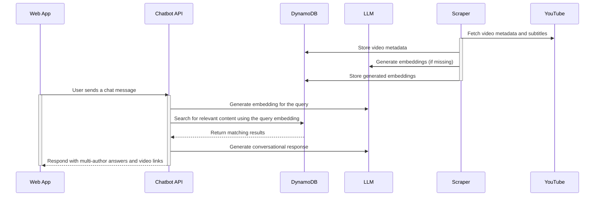

# YouTube Channel Chatbot

Conversational chatbot that answers questions from YouTube channels with smart, multi-author responses and video timecodes.

<!-- mdformat-toc start --slug=github --maxlevel=6 --minlevel=2 -->

- [Projects](#projects)
- [System Architecture](#system-architecture)

<!-- mdformat-toc end -->

## Projects

- [Scraper](scraper) — Parse YouTube channels and store data. (**Python**)
- [Chatbot API](backend) — Serve chatbot API based on scraped data. (**Python + FastAPI**)
- [Web App](frontend) — User interface to interact with chatbot. (**Angular - TypeScript**)

## System Architecture

