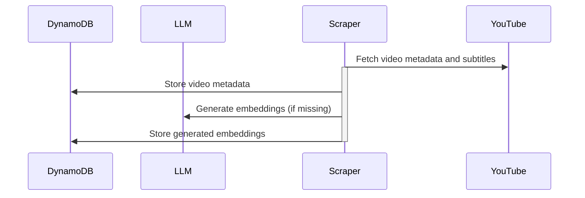

# YouTube Channel Chatbot — Backend

This project powers the chatbot backend by serving an API that answers questions based on YouTube channel data.

<!-- mdformat-toc start --slug=github --maxlevel=6 --minlevel=2 -->

- [Features](#features)
- [Memory Bank](#memory-bank)
- [Setup](#setup)
- [System Architecture](#system-architecture)

<!-- mdformat-toc end -->

## Features

- Load extracted YouTube data and embeddings.
- Serve conversational chatbot API endpoints.
- Maintain conversational context across messages.
- Link responses to original videos with timecodes.

## Memory Bank

- [Project Brief](memory_bank/project_brief.md): core requirements and goals.
- [Product Context](memory_bank/product_context.md): purpose, UX goals.
- [Active Context](memory_bank/active_context.md): current tasks, decisions, next steps.
- [System Patterns](memory_bank/system_patterns.md): achitecture, design patterns, relationships.
- [Tech Context](memory_bank/tech_context.md): dev setup, constraints, tools.
- [Progress](memory_bank/progress.md): current status, what’s done, issues.

## Setup

Instructions coming soon.

## System Architecture

